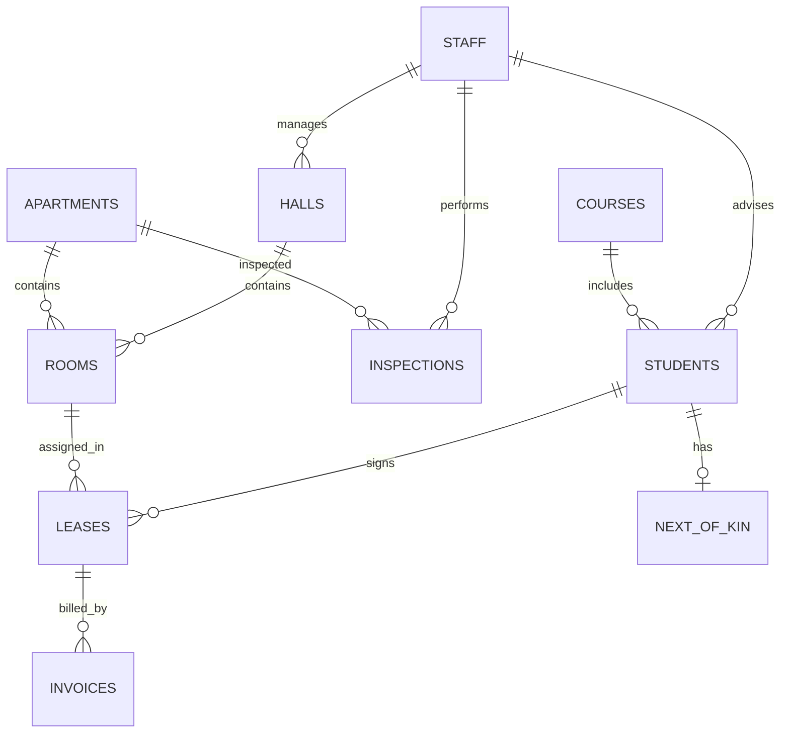

# University Accommodation Office System
## Full Project Explainer (CS266 DBMS)

This explainer is intentionally detailed and maps directly to the current codebase and schema.

## 0) DBMS Deep Dive: Tables, Entities, Relationships, Views, Constraints, and Data Semantics

### 0.1 High-level data model intent
The schema models a university accommodation office with these core concerns:
- People: students and staff
- Academic linkage: courses and advisers
- Housing inventory: halls, apartments, rooms (places)
- Occupancy contracts: leases
- Financial lifecycle: invoices and payment reminders
- Welfare/compliance: next-of-kin and inspections

The design is relational and normalized, with foreign keys and explicit integrity rules to avoid inconsistent housing state.

### 0.2 Physical tables and entity roles

#### 0.2.1 `staff`
Purpose:
- Stores operational staff data, including managers, advisers, and inspectors.

Primary key:
- `staff_id` (auto-increment integer)

Important attributes:
- Identity/contact: `first_name`, `last_name`, `email`
- HR/placement: `position`, `department_name`, `location`
- Optional profile: `dob`, `gender`, address fields, phone fields

Downstream relationships:
- One staff member may advise many students.
- One staff member may manage many halls.
- One staff member may perform many inspections.

#### 0.2.2 `courses`
Purpose:
- Academic catalog reference for student records.

Primary key:
- `course_number` (string)

Important attributes:
- `course_title`, instructor metadata, department metadata

Downstream relationships:
- One course can be linked to many students.

#### 0.2.3 `students`
Purpose:
- Canonical student profile and accommodation status table.

Primary key:
- `banner_id` (string)

Important attributes:
- Identity and contact details
- Demographics and academic fields (`major`, `minor`, `course_number`)
- Accommodation workflow state (`status` = `Placed` or `Waiting`)
- Optional adviser (`advisor_staff_id`)

Foreign keys:
- `course_number -> courses(course_number)` (`ON DELETE SET NULL`)
- `advisor_staff_id -> staff(staff_id)` (`ON DELETE SET NULL`)

Downstream relationships:
- One student can hold many leases over time.
- One student has at most one next-of-kin row (enforced by unique constraint in `next_of_kin`).

#### 0.2.4 `halls`
Purpose:
- University hall residence master data.

Primary key:
- `hall_id` (auto-increment integer)

Important attributes:
- Name, address, contact, manager assignment

Foreign keys:
- `manager_staff_id -> staff(staff_id)` (`ON DELETE RESTRICT`)

Downstream relationships:
- One hall can contain many rooms.

#### 0.2.5 `apartments`
Purpose:
- Apartment residence inventory.

Primary key:
- `apartment_id` (auto-increment integer)

Important attributes:
- Address and `number_of_bedrooms`

Check constraint:
- `number_of_bedrooms IN (3, 4, 5)`

Downstream relationships:
- One apartment can contain many rooms.
- One apartment can have many inspections.

#### 0.2.6 `rooms`
Purpose:
- Represents each allocatable accommodation place.

Primary key:
- `place_number` (integer, manually assigned)

Important attributes:
- `room_number`, `monthly_rent`, and parent residence pointer (`hall_id` or `apartment_id`)

Foreign keys:
- `hall_id -> halls(hall_id)`
- `apartment_id -> apartments(apartment_id)`

Check constraints and triggers:
- Rent must be non-negative (`monthly_rent >= 0`).
- Trigger-enforced exclusivity: exactly one of `hall_id` or `apartment_id` must be non-null.
  - Enforced by `trg_rooms_before_insert`
  - Enforced by `trg_rooms_before_update`

Downstream relationships:
- One room/place can appear in many leases over time.

#### 0.2.7 `leases`
Purpose:
- Occupancy contracts connecting students to places for a duration window.

Primary key:
- `lease_id` (auto-increment integer)

Important attributes:
- `banner_id`, `place_number`, `duration_semesters`
- `includes_summer_semester`
- `date_enter`, `date_leave`

Foreign keys:
- `banner_id -> students(banner_id)` (`ON DELETE CASCADE`)
- `place_number -> rooms(place_number)` (`ON DELETE RESTRICT`)

Downstream relationships:
- One lease can have multiple invoices.

#### 0.2.8 `invoices`
Purpose:
- Billing rows for rent obligations per lease.

Primary key:
- `invoice_id` (auto-increment integer)

Important attributes:
- `semester`, `amount_due`, `due_date`
- Payment tracking: `date_paid`, `payment_method`
- Reminder workflow: `first_reminder_date`, `second_reminder_date`

Foreign keys:
- `lease_id -> leases(lease_id)` (`ON DELETE CASCADE`)

Check constraints:
- `amount_due >= 0`

#### 0.2.9 `next_of_kin`
Purpose:
- Emergency contact details per student.

Primary key:
- `kin_id` (auto-increment integer)

Important attributes:
- Contact name, relationship, address, phone

Foreign keys and uniqueness:
- `banner_id -> students(banner_id)` (`ON DELETE CASCADE`)
- `banner_id` is unique, enforcing one-to-one from student to kin row.

#### 0.2.10 `inspections`
Purpose:
- Apartment quality/safety inspections performed by staff.

Primary key:
- `inspection_id` (auto-increment integer)

Important attributes:
- `apartment_id`, `staff_id`, `inspection_date`, `is_satisfactory`, `comments`

Foreign keys:
- `apartment_id -> apartments(apartment_id)` (`ON DELETE CASCADE`)
- `staff_id -> staff(staff_id)` (`ON DELETE RESTRICT`)

### 0.3 Relationship cardinalities (conceptual)

- `courses (1) -> (N) students`
- `staff (1) -> (N) students` via adviser assignment
- `staff (1) -> (N) halls` via manager assignment
- `halls (1) -> (N) rooms`
- `apartments (1) -> (N) rooms`
- `students (1) -> (N) leases`
- `rooms (1) -> (N) leases` (time-based occupancy history)
- `leases (1) -> (N) invoices`
- `students (1) -> (0..1) next_of_kin`
- `staff (1) -> (N) inspections`
- `apartments (1) -> (N) inspections`

### 0.4 ER-style diagram (logical)



### 0.5 Integrity and quality controls

The schema enforces data quality at multiple levels:
- Domain checks:
  - Bedroom counts restricted for apartments.
  - Non-negative money values for room rent and invoice amounts.
- FK constraints:
  - Prevent orphan rows and encode intended cascade/restrict behavior.
- Trigger rules:
  - `rooms` must belong to exactly one residence type (hall or apartment), never neither and never both.
- Enum constraints:
  - Student placement state (`Placed` / `Waiting`).

### 0.6 Index strategy and query performance intent

Indexes are placed on frequently filtered/joined fields:
- `students`: status, category, adviser
- `halls`: manager
- `rooms`: hall and apartment references
- `leases`: student, place, summer-flag
- `invoices`: lease, due date, date paid
- `inspections`: apartment, staff, satisfaction flag

This aligns with report routes that aggregate by category, search waiting list, compute unpaid invoices, and perform residence joins.

### 0.7 “Views, procedures, functions” status

Current state after refactor:
- SQL views are defined in `backend/schema.sql` for all assignment reports `(a)` to `(n)`.
- Stored procedures and SQL functions are not yet defined in schema.
- FastAPI report routes now read from DB views instead of duplicating all join logic inside route SQL.

So in MySQL Workbench, you can now open the Views section and directly demonstrate report objects such as:
- `v_hall_managers`
- `v_student_leases`
- `v_summer_leases`
- `v_student_rent_paid`
- `v_unpaid_invoices`
- `v_unsatisfactory_inspections`
- `v_hall_student_rooms`
- `v_waiting_list`
- `v_student_category_counts`
- `v_students_without_kin`
- `v_student_advisers`
- `v_hall_rent_stats`
- `v_hall_place_counts`
- `v_senior_staff`

### 0.8 Report query families and entity interplay

Report routes combine entities to answer operational questions:
- Hall administration: halls + staff
- Student occupancy: students + leases + rooms + halls/apartments
- Financial control: invoices + leases + students + rooms
- Compliance and governance: inspections + staff + apartments
- Planning analytics: student category counts, waiting list, hall place counts

## 1) Project Explainer & Introduction

This application is a DBMS-driven management system for university accommodation offices. It is designed to simulate realistic institutional workflows and show how normalized relational data can power both transaction processing (CRUD) and analytical reporting.

At a practical level, it gives staff a single system to:
- Register and manage students, courses, and staff.
- Maintain housing inventory across halls and apartments.
- Allocate places through leases.
- Track invoices, payments, and reminders.
- Record inspections and emergency contacts.
- Generate standardized reports for decision-making.

It solves common operational pain points:
- Inconsistent manual records.
- Missing relation links (student -> lease -> invoice).
- Difficult reporting from disconnected spreadsheets.
- Weak data integrity and validation.

## 2) Comprehensive Tech Stack Overview

### 2.1 Frontend stack

- React 18:
  - Builds modular, state-driven pages for login, CRUD studio, reports, and dashboards.
  - Supports component reuse and clear navigation flows.
- TypeScript:
  - Defines typed entity/report contracts (`frontend/src/types.ts`), reducing runtime shape errors.
- Vite:
  - Fast development server and optimized production bundle generation.
  - Proxies `/api`, `/auth`, `/health` to backend in local dev.
- Tailwind CSS:
  - Utility-based styling for fast and maintainable UI implementation.
- Framer Motion:
  - Adds transitions and animated interactions for clearer UX feedback.
- Lucide React:
  - Consistent iconography across views.

### 2.2 Backend stack

- FastAPI:
  - Route declaration, dependency injection, auth guards, and response serialization.
- SQLAlchemy Core:
  - Executes SQL operations without manually writing repetitive ORM models for each entity.
  - Uses reflected metadata to keep generic CRUD routes entity-agnostic.
- PyMySQL:
  - Actual MySQL DBAPI connector used by SQLAlchemy URL `mysql+pymysql://...`.
- python-dotenv:
  - Loads environment variables from `backend/.env`.
- python-jose:
  - JWT encode/decode.
- passlib:
  - Password hash verification for seeded users.

### 2.3 Database stack

- MySQL 8+:
  - ACID-compliant relational engine with robust foreign key/check/index support.
- SQL-level safeguards:
  - Constraints and triggers ensure data remains valid even if client-side validation is bypassed.

### 2.4 Why this stack is suitable for CS266

- Demonstrates core DBMS concepts directly in schema design.
- Provides realistic API/service architecture around relational data.
- Makes it easy to test both transactional and analytical workloads.

## 3) Architecture & Data Flow (End-to-End)

### 3.1 Frontend-to-backend communication

Flow:
1. UI events in pages (for example CRUD form submit or report run) call API helpers in `frontend/src/lib/api.ts`.
2. `apiRequest` builds fetch options, injects JWT if available, and calls backend routes.
3. Vite proxy forwards local frontend requests to FastAPI in development.
4. JSON response is rendered into cards, tables, and dashboards.

### 3.2 FastAPI role in request lifecycle

FastAPI in `backend/app/main.py` handles:
- Routing (`@app.get`, `@app.post`, `@app.put`, `@app.delete`)
- Dependency injection for:
  - DB session (`Depends(get_session)`)
  - Role guard (`Depends(READ_ROLES/WRITE_ROLES/ADMIN_ROLE)`)
- Validation/conversion:
  - Date parsing (`YYYY-MM-DD`)
  - bool/int/float normalization
  - ID type parsing based on entity config
- Error mapping:
  - DB integrity errors converted to useful HTTP status/details

### 3.3 SQLAlchemy + PyMySQL connection path

Where this is implemented:
- Connection settings: `backend/app/config.py`
- Engine/session/metadata: `backend/app/database.py`

Detailed role split:
- SQLAlchemy:
  - Builds engine and sessions.
  - Reflects table metadata (`MetaData().reflect`).
  - Executes select/insert/update/delete and SQL text report queries.
- PyMySQL:
  - Driver layer that opens and manages actual MySQL connections.
  - Chosen by the dialect prefix: `mysql+pymysql://...`.

Connection handling behavior:
- `pool_pre_ping=True` reduces stale-connection failures.
- `pool_recycle=300` refreshes older connections.
- TLS mode configurable via `DB_TLS_MODE` (`false`, `preferred`, `skip-verify`).

### 3.4 CRUD route internals

- Entity key from URL (`students`, `rooms`, etc.) is looked up in `TABLE_CONFIG`.
- The mapped table is loaded from reflected metadata.
- Query is built dynamically using SQLAlchemy Core.
- This avoids creating 10 separate CRUD controller files.

### 3.5 Report route internals

Each report route now:
- Selects from a dedicated SQL view.
- Uses `_run_report(session, sql, params)` for execution.
- Applies filtering parameters for parameterized reports (for example `banner_id`, `hall_id`, `due_before`).
- Converts rows to dictionaries and JSON.
- Encodes decimals safely through `_encode`.

### 3.6 Security and session model

- Login creates JWT with role claims.
- Protected endpoints decode JWT and enforce role permissions.
- Frontend stores token in local storage and reuses it per request.

## 4) Codebase Structure: “What is What”

```text
DBMS_courseproject/
|-- backend/
|   |-- app/
|   |   |-- main.py        # All API routes (auth, CRUD, reports, SPA fallback)
|   |   |-- database.py    # Engine/session/metadata reflection
|   |   |-- config.py      # Env parsing and settings
|   |   |-- auth.py        # JWT + role guards + seeded users
|   |-- schema.sql         # Core DB schema (tables/FKs/indexes/triggers)
|   |-- requirements.txt   # Backend dependencies
|   |-- tests/             # Route tests and runtime smoke tests
|-- frontend/
|   |-- src/
|   |   |-- lib/api.ts     # HTTP wrapper used by all UI pages
|   |   |-- config/entities.ts  # Entity form/table metadata
|   |   |-- config/reports.ts   # Report catalog and parameters
|   |   |-- pages/         # Home, login, studio, reports, pulse board
|   |-- vite.config.ts     # Dev proxy and server config
|-- docs/
|   |-- API.md             # Full API documentation
|-- seed.sql               # Optional sample records
|-- render.yaml            # Render deployment definition
```

Where the schema lives:
- Main schema file: `backend/schema.sql`
- Optional sample inserts: `seed.sql`

How the schema is used by backend:
- Backend does not auto-migrate.
- It reflects existing schema at runtime and assumes tables are already created in target DB.

## 5) Free Deployment Guide (Frontend + Backend + MySQL)

Below are practical free-tier deployment patterns.

### 5.1 Recommended free stack

- Frontend: Vercel (or Netlify)
- Backend: Render Web Service (or Railway)
- MySQL-compatible database: TiDB Serverless (or Aiven free trial/credits)

### 5.2 Step-by-step deployment (split architecture)

#### Step 1: Prepare repository
- Push latest code to GitHub.
- Ensure docs and env examples are up to date.

#### Step 2: Provision cloud database
Option A (recommended long-lived free): TiDB Serverless.
Option B: Aiven MySQL (check current free-tier/trial availability).

Create database/schema:
- Create a database named `uni_accom_python` (or your chosen DB name).
- Run `backend/schema.sql` against the cloud DB.
- Optional: run `seed.sql`.

Collect DB credentials:
- host
- port
- username
- password
- database name
- CA cert / TLS requirements

#### Step 3: Deploy backend (Render example)
- Create new Web Service from your GitHub repo.
- Runtime: Python.
- Build command:
  - `pip install -r backend/requirements.txt`
- Start command:
  - `python -m uvicorn app.main:app --app-dir backend --host 0.0.0.0 --port $PORT`

Set backend env vars:
- `DB_HOST`
- `DB_PORT`
- `DB_USER`
- `DB_PASSWORD`
- `DB_NAME`
- `DB_TLS_MODE` (usually `preferred` for managed cloud DB)
- `DB_CA_CERT_PATH` (if provider requires custom CA)
- `PORT=8000`
- Optional auth hardening:
  - `AUTH_SECRET_KEY`
  - `AUTH_TOKEN_EXPIRE_MINUTES`

Verify backend:
- Open `/health` and confirm status `ok`.

#### Step 4: Deploy frontend (Vercel example)
- Import `frontend/` as the project root (or configure monorepo settings accordingly).
- Build command:
  - `npm run build`
- Output directory:
  - `dist`

Set frontend env var:
- `VITE_API_BASE_URL=https://<your-backend-domain>`

Redeploy frontend and test:
- Login and open studio/reports pages.

#### Step 5: CORS and endpoint checks
- Backend currently allows all origins (`allow_origins=["*"]`).
- For production hardening, restrict origins to your frontend domain.

Smoke checks after deployment:
- `GET /health`
- `POST /auth/login`
- `GET /api/students` with bearer token
- `GET /api/reports/hall-managers`

### 5.3 Alternative: single-service deployment

You can also deploy only the backend and let it serve prebuilt frontend assets from `frontend/dist`.

Flow:
1. Build frontend (`npm run build`).
2. Ensure `frontend/dist` is available at runtime.
3. Deploy backend service.

This reduces moving parts but gives less flexibility than split frontend/backend hosting.

### 5.4 Free-tier caveats

- Cold starts on free services can delay first response.
- Some free DB tiers sleep or limit connections.
- Always configure retry-safe frontend UX for temporary startup latency.
- Set alerts/monitoring where available.

---

## 6) Full Flow Walkthrough With Actual Code (Step by Step)

This section traces one complete request path and then generalizes it for all report and CRUD flows.

### 6.1 Frontend request creation (React)

In `frontend/src/pages/ReportsPage.tsx`, each report card calls `runReport(report)`.

```tsx
const runReport = async (report: ReportDefinition): Promise<void> => {
  const params = paramState[report.id] ?? {};
  const endpoint = buildEndpoint(report, params);
  if (!endpoint) {
    pushToast({
      tone: "error",
      title: "Missing report parameters",
      description: "Please complete all required report inputs."
    });
    return;
  }

  setRunningId(report.id);
  try {
    const payload = await apiGet<unknown>(endpoint);
    setRows(normalizeRows(payload));
    setActiveReportId(report.id);
  } finally {
    setRunningId(null);
  }
};
```

### 6.2 Frontend API helper layer

`frontend/src/lib/api.ts` injects auth and performs the fetch call.

```ts
export async function apiRequest<T>(path: string, init: ApiRequestOptions = {}): Promise<T> {
  const { skipAuth = false, ...requestInit } = init;
  const headers = new Headers(requestInit.headers ?? {});

  if (!skipAuth && authToken && !headers.has("Authorization")) {
    headers.set("Authorization", `Bearer ${authToken}`);
  }

  const response = await fetch(buildUrl(path), { ...requestInit, headers });
  const payload = await parseResponse(response);
  if (!response.ok) {
    throw new ApiError(response.status, asErrorMessage(payload, `Request failed with status ${response.status}`));
  }
  return payload as T;
}
```

### 6.3 FastAPI route matching

Example route in `backend/app/main.py`:

```py
@app.get("/api/reports/hall-managers")
def report_hall_managers(
    _: AuthUser = Depends(READ_ROLES),
    session: Session = Depends(get_session),
) -> Any:
    sql = """
        SELECT hall_id, hall_name, manager_name, manager_phone
        FROM v_hall_managers
        ORDER BY hall_id
    """
    return _encode(_run_report(session, sql))
```

What happens here:
1. JWT role is validated by `READ_ROLES` dependency.
2. DB session is injected by `get_session`.
3. Query runs against a DB view.
4. Result set is JSON encoded and returned.

### 6.4 DB execution helper

`_run_report` in `backend/app/main.py`:

```py
def _run_report(session: Session, sql: str, params: dict[str, Any] | None = None) -> list[dict[str, Any]]:
    rows = session.execute(text(sql), params or {}).mappings().all()
    return [dict(row) for row in rows]
```

This converts SQLAlchemy row mappings into plain dictionaries for response serialization.

### 6.5 SQLAlchemy engine and PyMySQL driver

From `backend/app/database.py`:

```py
def _build_mysql_url(settings: Settings) -> str:
    user = quote_plus(settings.db_user)
    password = quote_plus(settings.db_password)
    return (
        f"mysql+pymysql://{user}:{password}@{settings.db_host}:{settings.db_port}/"
        f"{settings.db_name}?charset=utf8mb4"
    )
```

Meaning:
- `mysql+` chooses MySQL SQLAlchemy dialect.
- `pymysql` is the concrete DBAPI driver performing socket/TCP communication.

### 6.6 Environment loading and config resolution

From `backend/app/config.py`:

```py
BACKEND_ROOT = Path(__file__).resolve().parents[1]
load_dotenv(BACKEND_ROOT / ".env")
load_dotenv(override=False)
```

This ensures backend reads `backend/.env` regardless of current shell directory.

### 6.7 One full runtime example: report (e)

Report requirement:
- Students with unpaid invoices by a given date.

Frontend endpoint produced:
- `/api/reports/unpaid-invoices?due_before=2026-12-31`

Backend route SQL:

```sql
SELECT
    invoice_id,
    lease_id,
    banner_id,
    student_name,
    semester,
    amount_due,
    DATE_FORMAT(due_date, '%Y-%m-%d') AS due_date,
    place_number,
    room_number,
    residence_type,
    residence_address
FROM v_unpaid_invoices
WHERE due_date <= :due_before
ORDER BY invoice_id
```

Underlying view in `backend/schema.sql`:

```sql
CREATE VIEW v_unpaid_invoices AS
SELECT
    i.invoice_id,
    i.lease_id,
    s.banner_id,
    CONCAT(s.first_name, ' ', s.last_name) AS student_name,
    i.semester,
    i.amount_due,
    i.due_date,
    r.place_number,
    r.room_number,
    CASE WHEN r.hall_id IS NOT NULL THEN 'Hall' ELSE 'Apartment' END AS residence_type,
    CASE
        WHEN r.hall_id IS NOT NULL THEN CONCAT(h.street, ', ', h.city, ' ', h.postcode)
        ELSE CONCAT(a.street, ', ', a.city, ' ', a.postcode)
    END AS residence_address
FROM invoices i
JOIN leases l ON l.lease_id = i.lease_id
JOIN students s ON s.banner_id = l.banner_id
JOIN rooms r ON r.place_number = l.place_number
LEFT JOIN halls h ON h.hall_id = r.hall_id
LEFT JOIN apartments a ON a.apartment_id = r.apartment_id
WHERE i.date_paid IS NULL;
```

## 7) Report-by-Report Mapping: UI -> API -> VIEW -> Workbench Query

| ID | UI Endpoint | Backend View | Workbench demo query |
|---|---|---|---|
| a | `/api/reports/hall-managers` | `v_hall_managers` | `SELECT * FROM v_hall_managers ORDER BY hall_id;` |
| b | `/api/reports/student-leases` | `v_student_leases` | `SELECT * FROM v_student_leases ORDER BY banner_id, lease_id;` |
| c | `/api/reports/summer-leases` | `v_summer_leases` | `SELECT * FROM v_summer_leases ORDER BY lease_id;` |
| d | `/api/reports/student-rent-paid/{banner_id}` | `v_student_rent_paid` | `SELECT * FROM v_student_rent_paid WHERE banner_id = 'B001';` |
| e | `/api/reports/unpaid-invoices?due_before=...` | `v_unpaid_invoices` | `SELECT * FROM v_unpaid_invoices WHERE due_date <= '2026-12-31' ORDER BY invoice_id;` |
| f | `/api/reports/unsatisfactory-inspections` | `v_unsatisfactory_inspections` | `SELECT * FROM v_unsatisfactory_inspections ORDER BY inspection_date DESC;` |
| g | `/api/reports/hall-student-rooms/{hall_id}` | `v_hall_student_rooms` | `SELECT * FROM v_hall_student_rooms WHERE hall_id = 1 ORDER BY banner_id;` |
| h | `/api/reports/waiting-list` | `v_waiting_list` | `SELECT * FROM v_waiting_list ORDER BY banner_id;` |
| i | `/api/reports/student-category-counts` | `v_student_category_counts` | `SELECT * FROM v_student_category_counts ORDER BY category;` |
| j | `/api/reports/students-without-kin` | `v_students_without_kin` | `SELECT * FROM v_students_without_kin ORDER BY banner_id;` |
| k | `/api/reports/student-adviser/{banner_id}` | `v_student_advisers` | `SELECT * FROM v_student_advisers WHERE banner_id = 'B001';` |
| l | `/api/reports/rent-stats` | `v_hall_rent_stats` | `SELECT * FROM v_hall_rent_stats;` |
| m | `/api/reports/hall-place-counts` | `v_hall_place_counts` | `SELECT * FROM v_hall_place_counts ORDER BY hall_id;` |
| n | `/api/reports/senior-staff` | `v_senior_staff` | `SELECT * FROM v_senior_staff ORDER BY age DESC, staff_id;` |

## 8) Workbench Demo Script For Professor

Use this sequence live in MySQL Workbench:

```sql
USE uni_accom_python;

-- 1) Show all DB views created for assignment reports
SHOW FULL TABLES WHERE TABLE_TYPE = 'VIEW';

-- 2) Show one view definition
SHOW CREATE VIEW v_student_leases;

-- 3) Run sample report views directly
SELECT * FROM v_hall_managers ORDER BY hall_id;
SELECT * FROM v_student_category_counts ORDER BY category;
SELECT * FROM v_hall_rent_stats;

-- 4) Parameterized examples
SELECT * FROM v_student_rent_paid WHERE banner_id = 'B001';
SELECT * FROM v_unpaid_invoices WHERE due_date <= '2026-12-31';
SELECT * FROM v_hall_student_rooms WHERE hall_id = 1;
SELECT * FROM v_student_advisers WHERE banner_id = 'B001';
```

## 9) Why this now satisfies DBMS concept demonstration

- The report layer exists as explicit relational objects (SQL views) in the DB.
- FastAPI becomes an access/control layer over those DB objects.
- Frontend now shows which view each report uses and the exact Workbench SQL to reproduce it.
- You can demonstrate schema constraints, triggers, indexes, and report views from Workbench directly.

If you want to go one level deeper for viva/demo, the next extension is adding stored procedures for parameterized reports `(d)`, `(e)`, `(g)`, and `(k)` and then exposing those procedure calls from FastAPI.

## 10) Exhaustive Schema Dictionary (Every Column, Key, and Constraint)

This section is a literal schema dictionary for `backend/schema.sql`.

### 10.1 `staff`

| Column | Type | Key/Constraint | Null | Default | Meaning |
|---|---|---|---|---|---|
| `staff_id` | `INT` | PK, AUTO_INCREMENT | NO | auto | Staff identifier |
| `first_name` | `VARCHAR(100)` |  | NO |  | First name |
| `last_name` | `VARCHAR(100)` |  | NO |  | Last name |
| `email` | `VARCHAR(255)` | UNIQUE | NO |  | Staff email |
| `street` | `VARCHAR(255)` |  | YES | `NULL` | Address street |
| `city` | `VARCHAR(100)` |  | YES | `NULL` | Address city |
| `postcode` | `VARCHAR(20)` |  | YES | `NULL` | Address postcode |
| `dob` | `DATE` |  | YES | `NULL` | Date of birth |
| `gender` | `VARCHAR(20)` |  | YES | `NULL` | Gender |
| `position` | `VARCHAR(100)` |  | NO |  | Job role |
| `department_name` | `VARCHAR(150)` |  | YES | `NULL` | Department |
| `internal_phone` | `VARCHAR(30)` |  | YES | `NULL` | Internal extension |
| `room_number` | `VARCHAR(30)` |  | YES | `NULL` | Office room |
| `location` | `VARCHAR(100)` |  | NO |  | Office location |
| `created_at` | `TIMESTAMP` |  | NO | `CURRENT_TIMESTAMP` | Row creation timestamp |

### 10.2 `courses`

| Column | Type | Key/Constraint | Null | Default | Meaning |
|---|---|---|---|---|---|
| `course_number` | `VARCHAR(30)` | PK | NO |  | Course code |
| `course_title` | `VARCHAR(255)` |  | NO |  | Course title |
| `instructor_name` | `VARCHAR(150)` |  | NO |  | Instructor name |
| `instructor_phone` | `VARCHAR(30)` |  | YES | `NULL` | Instructor phone |
| `instructor_email` | `VARCHAR(255)` |  | YES | `NULL` | Instructor email |
| `instructor_room` | `VARCHAR(30)` |  | YES | `NULL` | Instructor room |
| `department_name` | `VARCHAR(150)` |  | NO |  | Department |
| `created_at` | `TIMESTAMP` |  | NO | `CURRENT_TIMESTAMP` | Row creation timestamp |

### 10.3 `students`

| Column | Type | Key/Constraint | Null | Default | Meaning |
|---|---|---|---|---|---|
| `banner_id` | `VARCHAR(20)` | PK | NO |  | Student identifier |
| `first_name` | `VARCHAR(100)` |  | NO |  | First name |
| `last_name` | `VARCHAR(100)` |  | NO |  | Last name |
| `street` | `VARCHAR(255)` |  | NO |  | Address street |
| `city` | `VARCHAR(100)` |  | NO |  | Address city |
| `postcode` | `VARCHAR(20)` |  | NO |  | Address postcode |
| `mobile_phone` | `VARCHAR(30)` |  | YES | `NULL` | Mobile phone |
| `email` | `VARCHAR(255)` |  | YES | `NULL` | Email |
| `dob` | `DATE` |  | NO |  | Date of birth |
| `gender` | `VARCHAR(20)` |  | NO |  | Gender |
| `category` | `VARCHAR(100)` |  | NO |  | Student category |
| `nationality` | `VARCHAR(100)` |  | NO |  | Nationality |
| `special_needs` | `TEXT` |  | YES | `NULL` | Special needs notes |
| `comments` | `TEXT` |  | YES | `NULL` | General comments |
| `status` | `ENUM('Placed','Waiting')` |  | NO |  | Accommodation status |
| `major` | `VARCHAR(120)` |  | NO |  | Major |
| `minor` | `VARCHAR(120)` |  | YES | `NULL` | Minor |
| `course_number` | `VARCHAR(30)` | FK -> `courses(course_number)` | YES | `NULL` | Course mapping |
| `advisor_staff_id` | `INT` | FK -> `staff(staff_id)` | YES | `NULL` | Adviser mapping |
| `created_at` | `TIMESTAMP` |  | NO | `CURRENT_TIMESTAMP` | Row creation timestamp |

### 10.4 `halls`

| Column | Type | Key/Constraint | Null | Default | Meaning |
|---|---|---|---|---|---|
| `hall_id` | `INT` | PK, AUTO_INCREMENT | NO | auto | Hall identifier |
| `hall_name` | `VARCHAR(150)` |  | NO |  | Hall name |
| `street` | `VARCHAR(255)` |  | NO |  | Hall street |
| `city` | `VARCHAR(100)` |  | NO |  | Hall city |
| `postcode` | `VARCHAR(20)` |  | NO |  | Hall postcode |
| `telephone` | `VARCHAR(30)` |  | NO |  | Hall phone |
| `manager_staff_id` | `INT` | FK -> `staff(staff_id)` | NO |  | Hall manager |
| `created_at` | `TIMESTAMP` |  | NO | `CURRENT_TIMESTAMP` | Row creation timestamp |

### 10.5 `apartments`

| Column | Type | Key/Constraint | Null | Default | Meaning |
|---|---|---|---|---|---|
| `apartment_id` | `INT` | PK, AUTO_INCREMENT | NO | auto | Apartment identifier |
| `street` | `VARCHAR(255)` |  | NO |  | Apartment street |
| `city` | `VARCHAR(100)` |  | NO |  | Apartment city |
| `postcode` | `VARCHAR(20)` |  | NO |  | Apartment postcode |
| `number_of_bedrooms` | `INT` | CHECK in `(3,4,5)` | NO |  | Bedroom count |
| `created_at` | `TIMESTAMP` |  | NO | `CURRENT_TIMESTAMP` | Row creation timestamp |

### 10.6 `rooms`

| Column | Type | Key/Constraint | Null | Default | Meaning |
|---|---|---|---|---|---|
| `place_number` | `INT` | PK | NO |  | Place identifier |
| `room_number` | `VARCHAR(20)` |  | NO |  | Display room number |
| `monthly_rent` | `DECIMAL(10,2)` | CHECK `>= 0` | NO |  | Monthly rent |
| `hall_id` | `INT` | FK -> `halls(hall_id)` | YES | `NULL` | Hall parent |
| `apartment_id` | `INT` | FK -> `apartments(apartment_id)` | YES | `NULL` | Apartment parent |
| `created_at` | `TIMESTAMP` |  | NO | `CURRENT_TIMESTAMP` | Row creation timestamp |

Trigger logic (`trg_rooms_before_insert`, `trg_rooms_before_update`) enforces exactly one parent (`hall_id` xor `apartment_id`).

### 10.7 `leases`

| Column | Type | Key/Constraint | Null | Default | Meaning |
|---|---|---|---|---|---|
| `lease_id` | `INT` | PK, AUTO_INCREMENT | NO | auto | Lease identifier |
| `banner_id` | `VARCHAR(20)` | FK -> `students(banner_id)` | NO |  | Student linked to lease |
| `place_number` | `INT` | FK -> `rooms(place_number)` | NO |  | Room/place linked to lease |
| `duration_semesters` | `VARCHAR(60)` |  | NO |  | Contract duration text |
| `includes_summer_semester` | `BOOLEAN` |  | NO | `FALSE` | Summer term included |
| `date_enter` | `DATE` |  | NO |  | Start date |
| `date_leave` | `DATE` |  | YES | `NULL` | End date |
| `created_at` | `TIMESTAMP` |  | NO | `CURRENT_TIMESTAMP` | Row creation timestamp |

### 10.8 `invoices`

| Column | Type | Key/Constraint | Null | Default | Meaning |
|---|---|---|---|---|---|
| `invoice_id` | `INT` | PK, AUTO_INCREMENT | NO | auto | Invoice identifier |
| `lease_id` | `INT` | FK -> `leases(lease_id)` | NO |  | Lease reference |
| `semester` | `VARCHAR(30)` |  | NO |  | Semester label |
| `amount_due` | `DECIMAL(10,2)` | CHECK `>= 0` | NO |  | Amount due |
| `due_date` | `DATE` |  | NO |  | Due date |
| `date_paid` | `DATE` |  | YES | `NULL` | Paid date |
| `payment_method` | `VARCHAR(50)` |  | YES | `NULL` | Payment method |
| `first_reminder_date` | `DATE` |  | YES | `NULL` | Reminder 1 |
| `second_reminder_date` | `DATE` |  | YES | `NULL` | Reminder 2 |
| `created_at` | `TIMESTAMP` |  | NO | `CURRENT_TIMESTAMP` | Row creation timestamp |

### 10.9 `next_of_kin`

| Column | Type | Key/Constraint | Null | Default | Meaning |
|---|---|---|---|---|---|
| `kin_id` | `INT` | PK, AUTO_INCREMENT | NO | auto | Kin row identifier |
| `banner_id` | `VARCHAR(20)` | UNIQUE, FK -> `students(banner_id)` | NO |  | Student reference |
| `name` | `VARCHAR(150)` |  | NO |  | Kin name |
| `relationship` | `VARCHAR(100)` |  | NO |  | Relationship |
| `street` | `VARCHAR(255)` |  | NO |  | Address street |
| `city` | `VARCHAR(100)` |  | NO |  | Address city |
| `postcode` | `VARCHAR(20)` |  | NO |  | Address postcode |
| `phone` | `VARCHAR(30)` |  | NO |  | Contact phone |
| `created_at` | `TIMESTAMP` |  | NO | `CURRENT_TIMESTAMP` | Row creation timestamp |

### 10.10 `inspections`

| Column | Type | Key/Constraint | Null | Default | Meaning |
|---|---|---|---|---|---|
| `inspection_id` | `INT` | PK, AUTO_INCREMENT | NO | auto | Inspection identifier |
| `apartment_id` | `INT` | FK -> `apartments(apartment_id)` | NO |  | Apartment reference |
| `staff_id` | `INT` | FK -> `staff(staff_id)` | NO |  | Inspector |
| `inspection_date` | `DATE` |  | NO |  | Inspection date |
| `is_satisfactory` | `BOOLEAN` |  | NO |  | Pass/fail flag |
| `comments` | `TEXT` |  | YES | `NULL` | Notes |
| `created_at` | `TIMESTAMP` |  | NO | `CURRENT_TIMESTAMP` | Row creation timestamp |

## 11) FK Behavior and Cardinality Matrix (Formal)

### 11.1 FK ON UPDATE / ON DELETE policy

| Child table | Child column | Parent table | ON UPDATE | ON DELETE |
|---|---|---|---|---|
| `students` | `course_number` | `courses(course_number)` | CASCADE | SET NULL |
| `students` | `advisor_staff_id` | `staff(staff_id)` | CASCADE | SET NULL |
| `halls` | `manager_staff_id` | `staff(staff_id)` | CASCADE | RESTRICT |
| `rooms` | `hall_id` | `halls(hall_id)` | CASCADE | CASCADE |
| `rooms` | `apartment_id` | `apartments(apartment_id)` | CASCADE | CASCADE |
| `leases` | `banner_id` | `students(banner_id)` | CASCADE | CASCADE |
| `leases` | `place_number` | `rooms(place_number)` | CASCADE | RESTRICT |
| `invoices` | `lease_id` | `leases(lease_id)` | CASCADE | CASCADE |
| `next_of_kin` | `banner_id` | `students(banner_id)` | CASCADE | CASCADE |
| `inspections` | `apartment_id` | `apartments(apartment_id)` | CASCADE | CASCADE |
| `inspections` | `staff_id` | `staff(staff_id)` | CASCADE | RESTRICT |

### 11.2 Cardinality matrix

| Parent | Child | Cardinality | Why |
|---|---|---|---|
| `courses` | `students` | `1:N` | Many students can share one course |
| `staff` | `students(advisor_staff_id)` | `1:N` | One adviser can advise many students |
| `staff` | `halls(manager_staff_id)` | `1:N` | One manager may manage multiple halls |
| `halls` | `rooms` | `1:N` | Hall has many places |
| `apartments` | `rooms` | `1:N` | Apartment has many places |
| `students` | `leases` | `1:N` | Student can have lease history |
| `rooms` | `leases` | `1:N` over time | Place reused over different terms |
| `leases` | `invoices` | `1:N` | Lease can generate multiple invoices |
| `students` | `next_of_kin` | `1:0..1` | `banner_id` unique in `next_of_kin` |
| `apartments` | `inspections` | `1:N` | Apartment can be inspected repeatedly |
| `staff` | `inspections` | `1:N` | Inspector can perform many inspections |

## 12) CRUD Pipeline in Code (Frontend -> FastAPI -> SQLAlchemy -> MySQL)

### 12.1 Frontend entity metadata drives generic CRUD

`frontend/src/config/entities.ts` defines endpoint + fields per entity, for example:

```ts
{
  key: "students",
  endpoint: "/api/students",
  idKey: "banner_id",
  fields: [ ... ]
}
```

`frontend/src/pages/EntityStudioPage.tsx` reuses that metadata for every operation:

```ts
const rows = await apiGet<DataRow[]>(entity.endpoint);
await apiPost(activeEntity.endpoint, payload);
await apiPut(`${activeEntity.endpoint}/${encodeURIComponent(String(recordId))}`, payload);
await apiDelete(`${activeEntity.endpoint}/${encodeURIComponent(String(recordId))}`);
```

### 12.2 Frontend API layer injects token automatically

`frontend/src/lib/api.ts`:

```ts
if (!skipAuth && authToken && !headers.has("Authorization")) {
  headers.set("Authorization", `Bearer ${authToken}`);
}
```

So CRUD and report calls are authenticated without every page manually adding headers.

### 12.3 Backend generic CRUD uses table reflection

`backend/app/main.py` maps URL entities to table metadata via `TABLE_CONFIG`:

```py
"students": {"table": "students", "pk": "banner_id", "id_type": "str", "auto_pk": False},
"next-of-kin": {"table": "next_of_kin", "pk": "kin_id", "id_type": "int", "auto_pk": True},
```

Core generic routes:

```py
@app.get("/api/{entity}")
@app.post("/api/{entity}")
@app.put("/api/{entity}/{record_id}")
@app.delete("/api/{entity}/{record_id}")
```

### 12.4 Type normalization before SQL write

`_normalize_value(...)` converts request payloads to DB-safe types:
- `DATE` -> `date.fromisoformat(...)`
- `BOOLEAN` -> `True/False`
- integer/float parsing for numeric columns

`_sanitize_payload(...)` filters unknown keys and enforces required PK behavior for non-auto tables.

### 12.5 DB error mapping and commit safety

`_safe_commit(...)` handles rollback and maps DB errors:
- duplicate key (`1062`) -> `409`
- invalid FK (`1452`) -> `400`
- check/trigger violations (`3819`, `1644`) -> `400`

This is why constraint errors surface as readable API responses instead of generic server crashes.

## 13) Views (a-n): Technical Mapping and SQL Intent

Views are defined in `backend/schema.sql` and consumed by routes in `backend/app/main.py`.

### 13.1 Core design principle

- SQL view = relational logic layer.
- FastAPI route = auth, parameter parsing, serialization layer.
- React page = parameter capture and rendering layer.

### 13.2 View list and purpose

| View | Purpose | Main route |
|---|---|---|
| `v_hall_managers` | Hall + manager contact | `/api/reports/hall-managers` |
| `v_student_leases` | Student lease + residence details | `/api/reports/student-leases` |
| `v_summer_leases` | Summer-only leases | `/api/reports/summer-leases` |
| `v_student_rent_paid` | Aggregated paid amount per student | `/api/reports/student-rent-paid/{banner_id}` |
| `v_unpaid_invoices` | Unpaid invoice rows with residence context | `/api/reports/unpaid-invoices` |
| `v_unsatisfactory_inspections` | Failed inspections with inspector | `/api/reports/unsatisfactory-inspections` |
| `v_hall_student_rooms` | Student-room mapping by hall | `/api/reports/hall-student-rooms/{hall_id}` |
| `v_waiting_list` | Students waiting for placement | `/api/reports/waiting-list` |
| `v_student_category_counts` | Category distribution | `/api/reports/student-category-counts` |
| `v_students_without_kin` | Students missing kin row | `/api/reports/students-without-kin` |
| `v_student_advisers` | Student + adviser details | `/api/reports/student-adviser/{banner_id}` |
| `v_hall_rent_stats` | min/max/avg hall rent | `/api/reports/rent-stats` |
| `v_hall_place_counts` | Place count by hall | `/api/reports/hall-place-counts` |
| `v_senior_staff` | Staff age > 60 | `/api/reports/senior-staff` |

### 13.3 Report execution helper

All report routes call the same helper:

```py
def _run_report(session: Session, sql: str, params: dict[str, Any] | None = None) -> list[dict[str, Any]]:
    rows = session.execute(text(sql), params or {}).mappings().all()
    return [dict(row) for row in rows]
```

So route code stays small and consistent.

## 14) Stored Procedures and SQL Functions (Current State + Ready-to-Use Templates)

### 14.1 Current repository status

- Views: implemented (`a` to `n`).
- Stored procedures: not yet created in `schema.sql`.
- SQL functions: not yet created in `schema.sql`.

### 14.2 Why procedures/functions may be added

Views are perfect for read-only set logic. Procedures/functions can be added for:
- parameterized report encapsulation
- reusable scalar calculations
- easier DBA-side governance

### 14.3 Procedure templates (optional extension)

```sql
DELIMITER //

CREATE PROCEDURE sp_report_student_rent_paid(IN p_banner_id VARCHAR(20))
BEGIN
    SELECT banner_id, student_name, total_paid
    FROM v_student_rent_paid
    WHERE banner_id = p_banner_id;
END//

CREATE PROCEDURE sp_report_unpaid_invoices(IN p_due_before DATE)
BEGIN
    SELECT
        invoice_id,
        lease_id,
        banner_id,
        student_name,
        semester,
        amount_due,
        due_date,
        place_number,
        room_number,
        residence_type,
        residence_address
    FROM v_unpaid_invoices
    WHERE due_date <= p_due_before
    ORDER BY invoice_id;
END//

DELIMITER ;
```

### 14.4 SQL function templates (optional extension)

```sql
DELIMITER //

CREATE FUNCTION fn_student_total_paid(p_banner_id VARCHAR(20))
RETURNS DECIMAL(10,2)
DETERMINISTIC
READS SQL DATA
BEGIN
    DECLARE v_total DECIMAL(10,2);

    SELECT COALESCE(SUM(i.amount_due), 0)
    INTO v_total
    FROM invoices i
    JOIN leases l ON l.lease_id = i.lease_id
    WHERE l.banner_id = p_banner_id
      AND i.date_paid IS NOT NULL;

    RETURN v_total;
END//

DELIMITER ;
```

### 14.5 FastAPI integration if procedures are enabled

```py
rows = session.execute(text("CALL sp_report_unpaid_invoices(:due_before)"), {"due_before": effective_due}).mappings().all()
```

This can replace equivalent `SELECT ... FROM view WHERE ...` route SQL if required by rubric.

## 15) FastAPI + SQLAlchemy + PyMySQL Internals (Exact Responsibility Split)

### 15.1 `config.py` (configuration loading)

- Loads env from `backend/.env` using:

```py
BACKEND_ROOT = Path(__file__).resolve().parents[1]
load_dotenv(BACKEND_ROOT / ".env")
load_dotenv(override=False)
```

- Validates required DB settings (`DB_HOST`, `DB_PORT`, `DB_USER`, `DB_NAME`).

### 15.2 `database.py` (engine/session/metadata)

- Connection URL builder:

```py
f"mysql+pymysql://{user}:{password}@{settings.db_host}:{settings.db_port}/{settings.db_name}?charset=utf8mb4"
```

- SQLAlchemy engine handles pooling (`pool_pre_ping`, `pool_recycle`).
- PyMySQL handles low-level MySQL protocol communication.
- Metadata reflection:

```py
metadata.reflect(bind=get_engine(), only=TABLE_NAMES)
```

So CRUD routes can target real DB tables without hardcoding ORM classes.

### 15.3 `auth.py` (JWT and roles)

- `authenticate_user(...)` validates username/password.
- `create_access_token(...)` signs JWT with `sub`, `role`, `exp`.
- `get_current_user(...)` decodes token and validates role consistency.
- `require_roles(...)` creates route guards used in `main.py`.

## 16) End-to-End Request Traces (Practical)

### 16.1 Login trace

1. User submits form in `LoginPage.tsx`.
2. `login()` in `AuthProvider` calls `POST /auth/login`.
3. FastAPI `auth_login` checks credentials and returns token + profile.
4. `persistSession` stores token in localStorage and sets API auth header source.
5. Protected routes become accessible (`RequireAuth`).

### 16.2 CRUD create trace (example: invoice)

1. UI fills invoice fields in `EntityStudioPage.tsx`.
2. `apiPost("/api/invoices", payload)` sends request.
3. `create_record` route resolves entity via `TABLE_CONFIG`.
4. `_sanitize_payload` + `_normalize_value` convert types safely.
5. SQLAlchemy executes `insert(table).values(**values)`.
6. `_safe_commit` commits or maps DB constraint errors.
7. Created row is re-fetched and returned.

### 16.3 Report trace (example: unpaid invoices)

1. Reports page builds endpoint with optional `due_before`.
2. `apiGet("/api/reports/unpaid-invoices?..." )` is called.
3. Route validates auth (`READ_ROLES`) and parses date.
4. Route executes SQL against `v_unpaid_invoices`.
5. `_encode` serializes response, frontend table renders rows.

## 17) Final Checklist: What This Explainer Now Covers

- Full stack architecture (React, FastAPI, SQLAlchemy, PyMySQL, MySQL).
- Every table and every column with type/null/default meaning.
- Primary keys, foreign keys, and exact FK action policies.
- Relationship cardinalities and ER mapping.
- Constraints, triggers, and indexes.
- Complete view-backed report model (`a` to `n`).
- Generic CRUD internals with real code flow.
- Auth, role guards, and request lifecycle.
- Procedure/function strategy with SQL templates.
- Practical end-to-end traces for login, CRUD, and report execution.

## 18) Zero-to-One Glossary (For Non-Backend Beginners)

This section is intentionally beginner-first. If someone asks "what is this?", use these definitions.

| Term | Simple meaning | How this project uses it |
|---|---|---|
| Client | The app the user interacts with | React frontend in `frontend/src` |
| Server | Program that receives HTTP requests and returns responses | FastAPI app in `backend/app/main.py` |
| API | Contract of endpoints the client can call | `/auth/*`, `/api/*`, `/api/reports/*` |
| Route/Endpoint | A URL + HTTP method pair | `GET /api/students`, `POST /auth/login` |
| HTTP Method | Action type (`GET`, `POST`, `PUT`, `DELETE`) | Read/create/update/delete operations |
| JSON | Text format for request/response data | All frontend/backend payload exchange |
| JWT Token | Signed identity ticket for logged-in users | Generated in `auth.py`, sent as Bearer token |
| Authorization Header | HTTP header carrying token | Injected by `api.ts` automatically |
| Dependency Injection | Framework passes required objects into route functions | `Depends(get_session)`, `Depends(READ_ROLES)` |
| SQLAlchemy Core | Python toolkit to build/execute SQL operations | Generic CRUD with reflected tables |
| PyMySQL | MySQL driver library used by SQLAlchemy | MySQL protocol execution layer |
| Reflection | Reading DB schema into runtime metadata | `metadata.reflect(... only=TABLE_NAMES)` |
| Foreign Key (FK) | Link from child table to parent table | Keeps cross-table references valid |
| Cardinality | How many records relate (`1:N`, `1:1`, etc.) | Documented in sections 0.3 and 11 |
| View | Saved SELECT query treated like virtual table | Reports `a` to `n` are view-backed |
| Stored Procedure | Named SQL program called with `CALL` | Optional extension templates provided |
| SQL Function | Reusable SQL function returning value | Optional extension templates provided |

## 19) Frontend Routing and UI-Control Flow (Detailed)

### 19.1 App bootstrap order

When frontend starts, this wrapper order is important:

1. `BrowserRouter`: URL path state.
2. `ToastProvider`: user notifications.
3. `ThemeProvider`: visual theme state.
4. `AuthProvider`: login session + permissions.
5. `App`: route tree and page rendering.

This order is defined in `frontend/src/main.tsx`.

### 19.2 Route guard logic

`frontend/src/App.tsx` has three guards:

1. `LoginOnly`: blocks `/login` for already-authenticated users.
2. `RequireAuth`: protects app pages (`/`, `/studio`, `/reports`, `/pulse`).
3. `FallbackRoute`: catches unknown URLs and redirects appropriately.

### 19.3 Login path in UI

In `LoginPage.tsx`:

1. Form submit calls `handleSubmit`.
2. `handleSubmit` calls `login(cleanUsername, password)` from `AuthProvider`.
3. On success, user is redirected to the destination route.

In `AuthProvider.tsx`:

1. `login` performs `POST /auth/login`.
2. `persistSession` stores token/user in memory + localStorage.
3. API layer receives auth token via `setApiAuthToken`.

### 19.4 CRUD path in UI

In `EntityStudioPage.tsx`:

1. `fetchRecords` -> `apiGet(entity.endpoint)`.
2. `handleSubmit` chooses `apiPost` (create) or `apiPut` (update).
3. `handleDelete` uses `apiDelete` after confirm dialog.

UI fields are generated from `frontend/src/config/entities.ts`, not hardcoded per table.

### 19.5 Report path in UI

In `ReportsPage.tsx`:

1. `buildEndpoint` fills path params and query params.
2. `runReport` calls `apiGet(endpoint)`.
3. Result table renders dynamic columns.
4. DBMS proof block shows object type, object name, workbench query, and backend route query.

Report metadata comes from `frontend/src/config/reports.ts`.

## 20) Backend Routing and Request Pipeline (Detailed)

### 20.1 Endpoint groups

The backend route groups are:

1. Health and static:
  - `GET /health`
  - `GET /` and SPA fallback serving `frontend/dist`
2. Auth:
  - `POST /auth/login`
  - `GET /auth/me`
3. Reports:
  - `GET /api/reports/*` for `a` to `n`
4. Generic CRUD:
  - `GET /api/{entity}`
  - `GET /api/{entity}/{record_id}`
  - `POST /api/{entity}`
  - `PUT /api/{entity}/{record_id}`
  - `DELETE /api/{entity}/{record_id}`

### 20.2 Role permissions

Role dependencies are declared once and reused:

1. `READ_ROLES`: `admin`, `manager`, `viewer`.
2. `WRITE_ROLES`: `admin`, `manager`.
3. `ADMIN_ROLE`: `admin` only.

Every route chooses one of these dependencies.

### 20.3 Request processing stages

For a protected request, FastAPI pipeline is:

1. Route match by method + URL.
2. Run auth dependency (`get_current_user` via `require_roles`).
3. Open DB session via `get_session`.
4. Validate/normalize parameters and payload.
5. Execute SQL through SQLAlchemy.
6. Commit/rollback as needed.
7. Encode response as JSON.

## 21) Generic CRUD Mechanics With Real Type Handling

### 21.1 Entity dispatch

`TABLE_CONFIG` maps URL entity keys to DB details:

- table name
- primary key field
- id type (`int` or `str`)
- whether PK is auto-generated

So `/api/next-of-kin` correctly targets table `next_of_kin`.

### 21.2 Input normalization behavior

`_normalize_value` converts incoming payload values according to actual SQL column type:

1. `DATE`: expects `YYYY-MM-DD`, else `400`.
2. `DATETIME`: expects ISO datetime string.
3. `BOOLEAN`: accepts `true/false/1/0/yes/no` variants.
4. Integer columns: parsed to `int`.
5. Numeric/decimal columns: parsed to `float`.

This prevents common frontend-to-DB type mismatch failures.

### 21.3 Create flow (`POST /api/{entity}`)

1. Resolve entity config.
2. Sanitize payload.
3. Execute `insert(table).values(...)`.
4. Commit with `_safe_commit`.
5. Resolve inserted ID (auto or manual PK).
6. Re-query created row and return it.

### 21.4 Update flow (`PUT /api/{entity}/{record_id}`)

1. Parse `record_id` according to id type.
2. Sanitize payload for update mode.
3. Execute `update(...).where(pk == id)`.
4. If rowcount is zero -> `404`.
5. Commit and return updated row.

### 21.5 Delete flow (`DELETE /api/{entity}/{record_id}`)

1. Parse ID.
2. Execute `delete(...).where(pk == id)`.
3. If rowcount is zero -> `404`.
4. Commit and return `204 No Content`.

## 22) Error Mapping Matrix (DB -> API)

`_map_integrity_error` maps MySQL errors into clean API responses:

| DB code | Typical reason | API status | API detail |
|---|---|---|---|
| `1062` | Duplicate unique/PK value | `409` | duplicate key constraint violated |
| `1452` | FK value points to missing parent | `400` | foreign key reference is invalid |
| `3819` | CHECK constraint failed | `400` | request violates database validation rules |
| `1644` | Trigger used `SIGNAL` | `400` | request violates database validation rules |
| `1406` | Data too long / invalid fit | `400` | request violates database validation rules |

This is why users get understandable messages instead of raw SQL tracebacks.

## 23) Complete Reports Catalog (a-n) With Runtime Behavior

For each report route, the runtime behavior is:

1. Apply `READ_ROLES` auth dependency.
2. Parse any path/query parameter.
3. Execute SQL selecting from one view.
4. Encode and return rows.

| ID | Route | Parameters | Source View | Result shape |
|---|---|---|---|---|
| a | `/api/reports/hall-managers` | none | `v_hall_managers` | hall + manager contact |
| b | `/api/reports/student-leases` | none | `v_student_leases` | lease + residence context |
| c | `/api/reports/summer-leases` | none | `v_summer_leases` | subset of summer leases |
| d | `/api/reports/student-rent-paid/{banner_id}` | `banner_id` path | `v_student_rent_paid` | one student aggregate |
| e | `/api/reports/unpaid-invoices` | `due_before` query (optional; defaults today) | `v_unpaid_invoices` | overdue unpaid invoices |
| f | `/api/reports/unsatisfactory-inspections` | none | `v_unsatisfactory_inspections` | failed inspection rows |
| g | `/api/reports/hall-student-rooms/{hall_id}` | `hall_id` path | `v_hall_student_rooms` | hall student-room mapping |
| h | `/api/reports/waiting-list` | none | `v_waiting_list` | waiting students |
| i | `/api/reports/student-category-counts` | none | `v_student_category_counts` | category counts |
| j | `/api/reports/students-without-kin` | none | `v_students_without_kin` | missing kin rows |
| k | `/api/reports/student-adviser/{banner_id}` | `banner_id` path | `v_student_advisers` | student + adviser details |
| l | `/api/reports/rent-stats` | none | `v_hall_rent_stats` | min/max/avg rent |
| m | `/api/reports/hall-place-counts` | none | `v_hall_place_counts` | capacity count per hall |
| n | `/api/reports/senior-staff` | none | `v_senior_staff` | staff age > 60 |

## 24) SQL View Patterns Explained (Why Each View Looks the Way It Does)

### 24.1 Join-heavy view pattern (context reports)

Examples: `v_student_leases`, `v_unpaid_invoices`

Pattern:

1. Start from event table (`leases`, `invoices`).
2. Join identity table (`students`).
3. Join location table (`rooms`).
4. LEFT JOIN hall/apartment to support either residence model.
5. Add derived columns (`residence_type`, display addresses).

### 24.2 Filtered subset view pattern

Examples: `v_summer_leases`, `v_waiting_list`, `v_unsatisfactory_inspections`

Pattern:

1. Reuse base relation.
2. Apply strict WHERE condition.
3. Keep route logic very small.

### 24.3 Aggregate view pattern

Examples: `v_student_category_counts`, `v_hall_rent_stats`, `v_hall_place_counts`

Pattern:

1. Group rows by dimension.
2. Compute aggregate metrics (`COUNT`, `MIN`, `MAX`, `AVG`, conditional `SUM`).
3. Route returns analytics-ready records directly.

## 25) Stored Procedures and SQL Functions: Full Optional Template Set

If rubric requires explicit procedures/functions in addition to views, start with these.

### 25.1 Procedures for parameterized report cases (d, e, g, k)

```sql
DELIMITER //

CREATE PROCEDURE sp_report_student_rent_paid(IN p_banner_id VARCHAR(20))
BEGIN
   SELECT banner_id, student_name, total_paid
   FROM v_student_rent_paid
   WHERE banner_id = p_banner_id;
END//

CREATE PROCEDURE sp_report_unpaid_invoices(IN p_due_before DATE)
BEGIN
   SELECT *
   FROM v_unpaid_invoices
   WHERE due_date <= p_due_before
   ORDER BY invoice_id;
END//

CREATE PROCEDURE sp_report_hall_student_rooms(IN p_hall_id INT)
BEGIN
   SELECT banner_id, student_name, hall_name, room_number, place_number
   FROM v_hall_student_rooms
   WHERE hall_id = p_hall_id
   ORDER BY banner_id;
END//

CREATE PROCEDURE sp_report_student_adviser(IN p_banner_id VARCHAR(20))
BEGIN
   SELECT banner_id, student_name, adviser_name, adviser_phone
   FROM v_student_advisers
   WHERE banner_id = p_banner_id;
END//

DELIMITER ;
```

### 25.2 SQL functions for reusable scalar logic

```sql
DELIMITER //

CREATE FUNCTION fn_student_total_paid(p_banner_id VARCHAR(20))
RETURNS DECIMAL(10,2)
DETERMINISTIC
READS SQL DATA
BEGIN
   DECLARE v_total DECIMAL(10,2);

   SELECT COALESCE(SUM(i.amount_due), 0)
   INTO v_total
   FROM invoices i
   JOIN leases l ON l.lease_id = i.lease_id
   WHERE l.banner_id = p_banner_id
    AND i.date_paid IS NOT NULL;

   RETURN v_total;
END//

CREATE FUNCTION fn_staff_age(p_staff_id INT)
RETURNS INT
DETERMINISTIC
READS SQL DATA
BEGIN
   DECLARE v_age INT;

   SELECT TIMESTAMPDIFF(YEAR, dob, CURDATE())
   INTO v_age
   FROM staff
   WHERE staff_id = p_staff_id;

   RETURN v_age;
END//

DELIMITER ;
```

## 26) Complete Relationship Explanation in Plain English (Teach Mode)

Use this exact teaching script if audience is new.

1. "A student is the center of occupancy data."
  - Student connects to leases.
  - Lease connects to one room/place.
  - Lease then connects to invoices.

2. "A place belongs to exactly one residence type."
  - Either a hall or an apartment.
  - Trigger blocks invalid dual or missing parent.

3. "Financial records are lease-based, not student-direct."
  - This preserves contract history and prevents ambiguity.

4. "Emergency contact is capped at one row per student."
  - Unique constraint on `next_of_kin.banner_id` enforces this.

5. "Inspections are apartment-level quality events by staff."
  - This supports governance and accountability.

## 27) Step-by-Step Demonstration Script (For Viva / Interview)

### 27.1 Schema proof

1. Open Workbench and run `SHOW TABLES;`.
2. Open `rooms` table and show FK + trigger logic.
3. Explain why room cannot belong to both hall and apartment.

### 27.2 API proof

1. Login using `/auth/login`.
2. Call `/auth/me` with bearer token.
3. Show role-based response.

### 27.3 CRUD proof

1. Create student via `/api/students`.
2. Create lease via `/api/leases`.
3. Create invoice via `/api/invoices`.
4. Demonstrate that wrong FK returns readable `400`.

### 27.4 Reporting proof

1. Call `/api/reports/student-category-counts`.
2. In Workbench run same view query.
3. Show same result shape and explain backend just brokers authenticated access.

## 28) "If You Remember Only 10 Things" Summary

1. Frontend is React + TypeScript, backend is FastAPI, DB is MySQL.
2. SQLAlchemy Core is used with reflected tables for generic CRUD.
3. PyMySQL is the actual MySQL driver under SQLAlchemy.
4. JWT auth controls access by role.
5. CRUD routes are generic and entity-driven through `TABLE_CONFIG`.
6. Data type conversion is handled centrally before DB writes.
7. DB constraints + triggers are the final integrity gate.
8. Reports `a` to `n` are view-backed, not hardcoded giant query blocks in frontend.
9. Error mapping converts DB-level failures into clear API messages.
10. The design cleanly separates concerns: UI, API control, and SQL logic.
